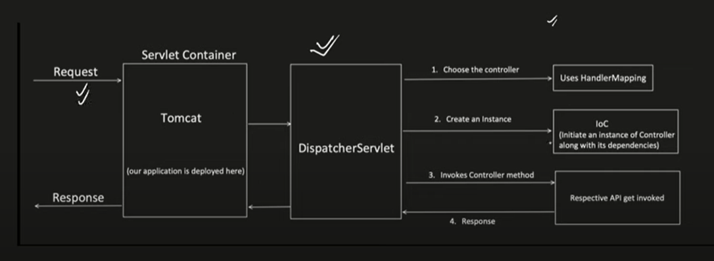

:toc: left
// :toc-title: Table of sak

== spring boot notes

=== request flow in spring boot

* request -> servlet container -> dispatcher servlet
* Dispatcher servlet do:
** choose controller -> IOC -> object create
** preHandle will execute
** call to controller
** postHandle
** afterCompletion
** get response from controller

=== oauth2
- framework, access to data
- john-res owner
- instagram -client
- gmail- auth
- gmail- res hosting server-{toc}w

{}

=== get access token
- auth code grant
- reg----
- instagram reg with Google.
- google ask app name, redirect url---max 3
- google provide id & secret
- john - login with gmail
- instagram needs auth code-------
- but he will not go... gmail will come to his home
- gmail come to insta, he gives him auth code
- insta to go gmail & ask for access & refresh token
- insta got token -- ask gmail(rhs) give me some data
- gmail(rhs) will validate & then share data

